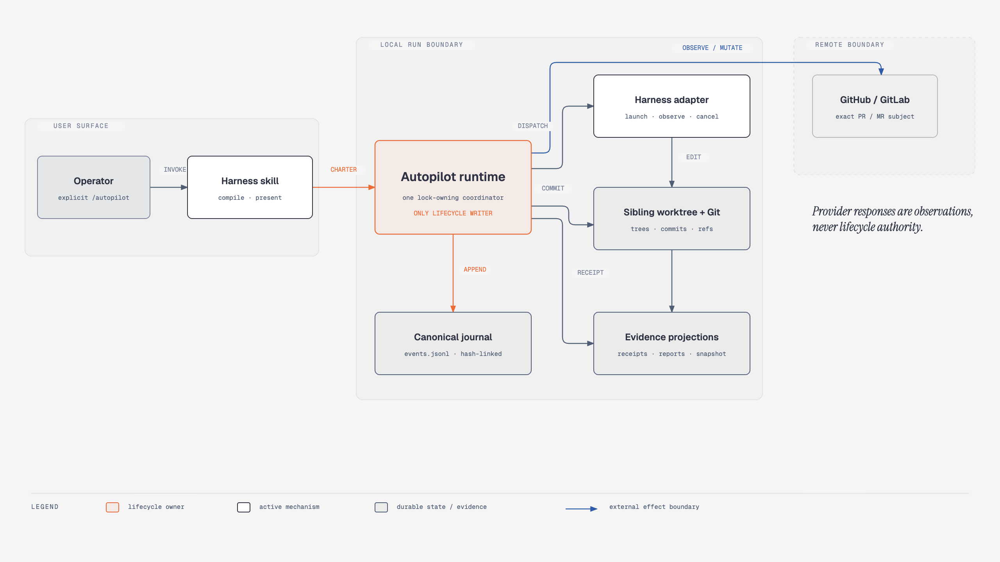
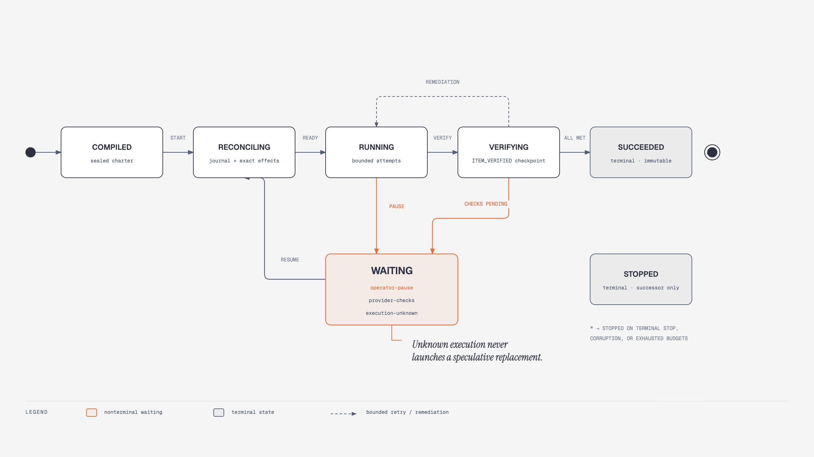

# Harness-agnostic Autopilot design

- **Status:** Developer-preview implementation available; POSIX attempt-scoped implementation-process reattachment is packaged, while provider notification wake and restack evidence remain incomplete
- **Date:** 2026-08-22
- **Audience:** Coding-harness maintainers and adapter authors
- **Implementation plan:** [Autopilot implementation plan](implementation-plan.md)
- **Decision record:** [Use a durable event engine with explicit authority](adr/0001-durable-event-engine.md)

## Summary

Autopilot lets a user hand a bounded coding objective to a local agent harness and leave it unattended. The user explicitly invokes `/autopilot` with a natural-language request, defines a checkable completion condition, and grants specific effects such as commit, push, change-request creation, or merge. Autopilot compiles that request into an immutable run charter and drives the run until the charter is satisfied or recovery budgets are exhausted.

A bundled TypeScript CLI is the sole lifecycle owner. Claude Code, Codex, Pi, and OpenCode integrations act as execution and user-interface adapters. Git owns code identity. An append-only journal owns lifecycle history. Verification receipts tied to exact commits or tree identities own evidence. Harness output cannot mutate lifecycle state or declare success directly.

The initial distribution requires Node.js 24 or newer. Node is an explicit Autopilot prerequisite rather than an assumed property of an installed harness. Standalone executables built from the same TypeScript engine may be added later.

## Implemented contract decisions

Implementation resolved four details that the original pseudocode left open:

- A proposed charter contains every resolved field except `charterHash`. The CLI validates it, computes the hash, and persists the sealed charter. Changed authority or budgets require a successor run.
- Grants name an actor: `worker`, harness `adapter`, `runtime`, or `delivery`. Harness authentication cannot authorize worker network access or provider mutation.
- `harnessAdapter` and remote `deliveryTarget` are sealed mechanics. Model names and reasoning settings remain adapter configuration rather than lifecycle state.
- Handwritten TypeScript validators are authoritative at runtime. Published JSON Schemas describe interchange without adding a production validation dependency.

The skill is the user-facing lifecycle interface. It invokes the copied runtime through `node runtime/dist/src/cli.js` internally; the shorter `autopilot` executable exists only when the package bin has been explicitly installed or linked. Direct commands are documented in the [runtime CLI reference](runtime-cli.md) for maintainers and recovery.

## Goals

Autopilot must:

- Start from one explicit `/autopilot` invocation with a natural-language objective.
- Run one objective, a queue of independent items, or an ordered stack.
- Support local-only delivery, change-request preparation, and authorized merge.
- Use explicit per-run capability grants. Missing grants mean denial.
- Continue through reversible implementation decisions without asking the absent user.
- Retry and replan within declared budgets without weakening completion criteria.
- Stop durably when it cannot satisfy the charter.
- Resume after process exit or context loss by reconciling durable state and observed effects.
- Support Claude Code, Codex, Pi, and OpenCode through a stable adapter protocol.
- Support GitHub pull requests and GitLab merge requests without provider-specific core behavior.
- Produce evidence and a decision trail that a user can audit after returning.

## Non-goals

The first version will not:

- Run as a system daemon or cloud coordinator.
- Implement a general-purpose workflow scheduler.
- Support multiple lifecycle engines in different languages.
- Infer authority from repository configuration or issue text.
- Deploy software, force-push shared branches, delete branches, run destructive resets or cleans, or remove dirty worktrees.
- Install tools, download runtimes, update harnesses, or modify global configuration.
- Guarantee that work continues after the CLI process exits. It guarantees resumability.
- Claim that prompt-only restrictions provide enforced isolation.

## Caller experience

A single objective can grant local edits and commits while withholding remote effects:

```text
/autopilot I am going to sleep. Work overnight on migrating this Java backend
from Spring Boot 3.x to 4.0.0 in a fresh worktree. Done means ./mvnw verify,
integration tests, and application-context smoke tests pass, no Boot 3.x
artifacts remain, and the migration guide is updated. Commit without asking.
Do not push, merge, or deploy.
```

An independent queue can grant merge authority:

```text
/autopilot I am going to sleep. Upgrade these five independent Java services
from Spring Boot 3.x to 4.0.0 overnight. Use one branch and worktree per service.
Run each Maven verify build and startup smoke test. Open a change request for
each passing service and merge only its verified current head. Never deploy or force-push.
```

An ordered stack can withhold shipping:

```text
/autopilot I am going to sleep. Work overnight on an ordered Spring Boot 4
migration stack: upgrade the parent build and BOM, migrate shared security and
configuration, then update service modules. Verify and push every branch. Do not
merge or deploy. I will review the stack in the morning. Use feature/{ticket}-{item-slug}
for branch names.
```

The harness proposes a charter from the request and repository evidence. The CLI validates the proposal. The compiler may derive mechanical prerequisites entailed by an explicit outcome, such as push and change-request authority for an authorized merge, but it records every derived grant before sealing. It never derives force-push, deployment, destructive cleanup, or unrelated credentials.

Autopilot asks before unattended execution only when the objective, replacement behavior, ordering, delivery intent, or acceptance criteria require a genuine product decision. Missing tools or capabilities produce a preflight failure with setup instructions.

Users manage lifecycle state through `/autopilot status`, `/autopilot pause`, `/autopilot resume`, `/autopilot stop`, and `/autopilot wrap up`, or natural wording supplied after explicit `/autopilot` invocation. The internal runtime commands are:

```bash
autopilot [--state-dir <path>] start <charter-file>
autopilot [--state-dir <path>] status [run-id]
autopilot [--state-dir <path>] resume [run-id]
autopilot [--state-dir <path>] pause [run-id]
autopilot [--state-dir <path>] stop [run-id]
autopilot [--state-dir <path>] [--handoff] wrap-up [run-id]
autopilot doctor
```

Omitted-ID lifecycle commands discover unsuperseded leaf runs by exact canonical repository identity. They mutate only one unambiguous eligible run; otherwise they return structured choices. `pause` and `stop` write token-bound control requests when another process owns the run, so the foreground coordinator remains the only journal writer. Pause cancels implementation work, proves quiescence, retires the exact lease, and records nonterminal operator waiting; stop remains terminal.

`start` runs in the foreground by default. A harness may use its supported background-process mechanism. If a harness cannot preserve background processes, its integration must show the equivalent terminal command instead of claiming unattended continuity.

## System boundary

The system has four owners:

1. **Harness skill.** Converts the conversation into a proposed charter, invokes the CLI, and presents status.
2. **Autopilot runtime.** Validates authority, owns lifecycle transitions, dispatches work, runs verification, reconciles effects, and decides completion.
3. **Harness adapter.** Starts a bounded fresh agent session and translates its observable events into the portable protocol.
4. **Delivery adapter.** Observes and changes provider state for GitHub, GitLab, or another supported provider.

[](diagrams/autopilot-runtime-ownership.html)

*Runtime ownership. Select the image to open the standalone HTML figure.*

The runtime does not embed an LLM SDK. Adapters call public harness CLI or SDK surfaces. A harness session receives a versioned attempt context derived from the sealed charter, journal prefix, Git identity, and receipts. The context contains only the current item, dependencies, predicates, bounded failure facts, remaining budgets, allowed paths, forbidden effects, and result format. It is stored as an immutable attempt artifact and hashed from `ATTEMPT_STARTED`; it is a rebuildable projection, not lifecycle state.

## Run charter

The following TypeScript is an abbreviated view. The compiled contract and runtime validator are in `skills/autopilot/runtime/src/charter.ts`.

```ts
interface RunCharter {
  readonly schemaVersion: 1;
  readonly runId: string;
  readonly sourceText: string;
  readonly createdAt: string;
  readonly repository: {
    readonly root: string;
    readonly baseRef: string;
    readonly baseCommit: string;
    readonly writableRoots: readonly string[];
  };
  readonly harnessAdapter: "pi" | "claude-code" | "codex" | "opencode";
  readonly mode: "single" | "independent-queue" | "ordered-stack";
  readonly work: readonly WorkItem[];
  readonly delivery: "local-commits" | "change-request-ready" | "merge-verified";
  readonly deliveryTarget?: {
    readonly provider: "github" | "gitlab";
    readonly remote: string;
    readonly baseBranch: string;
  };
  readonly grants: readonly CapabilityGrant[];
  readonly gates: readonly VerificationGate[];
  readonly waivers: readonly EvidenceWaiver[];
  readonly limits: RunLimits;
  readonly assumptions: readonly RecordedAssumption[];
  readonly minimumAssurance: "cooperative" | "enforced";
  readonly resolutionSources: Readonly<Record<string, ResolutionSource>>;
  readonly charterHash: string;
}

interface WorkItem {
  readonly id: string;
  readonly title?: string; // concise change-request title; required from new charter compilers
  readonly objective: string;
  readonly writableRoots: readonly string[];
  readonly dependsOn: readonly string[];
  readonly acceptance: readonly Predicate[];
  readonly branchName: string;
}
```

The sealed charter owns authority, completion predicates, waivers, budgets, concise work-item titles, resolved branch names, and delivery policy. It does not change during a run. A changed objective or grant creates a successor run that references the earlier charter.

Every resolved field records its source during compilation. Repository configuration may supply mechanics such as verification commands and branch conventions, but it cannot grant external effects.

## State model

Run states are:

```text
COMPILED -> RECONCILING -> RUNNING <-> WAITING
                              |
                              v
                           VERIFYING
                              |
                              v
                    SUCCEEDED | STOPPED
```

[](diagrams/autopilot-lifecycle-waiting.html)

*Lifecycle waiting. Select the image to open the standalone HTML figure.*

`SUCCEEDED` is reachable only after fresh evaluation of the original completion predicates. `STOPPED` is a durable terminal outcome with a reason, preserved artifacts, unmet predicates, and exact remediation or successor-run instructions. `WAITING` identifies operator pause, an exact-subject provider-check session, or an execution whose quiescence cannot be proven after coordinator loss. `resume` continues a waiting or interrupted nonterminal run, but it refuses a replacement attempt while execution remains unknown. It does not reopen a terminal run with exhausted authority or budgets.

Selected actionable review feedback for a successful open change request creates a new single-item charter with an explicit `amends` reference and a head-bound, content-hashed `reviewFeedback` snapshot. The predecessor remains terminal and immutable. Under a shared branch-ownership lock, the successor may adopt the retained worktree only when the predecessor journal, accepted commit, clean worktree, local branch, remote branch, and exact open change request still agree. It uses fresh authority and receipts and may update the existing head only through an ordinary fast-forward push. After the successor passes its predicates and the exact PR/MR is observed at that commit, a separately granted delivery effect may resolve only the sealed provider-resolvable threads.

Work-item states are:

```text
PENDING -> READY -> ACTIVE -> VERIFYING -> SATISFIED
                         \-> BLOCKED | ABANDONED
```

Only satisfied dependencies make an item ready. Workers cannot set item states. A replan may replace pending or blocked work within the charter limits, but it cannot alter satisfied evidence, authority, waivers, or completion predicates.

Each execution attempt has an immutable attempt ID, expected base commit and tree, deadline, lease epoch, context hash, adapter execution ID, and idempotency key. Results from an expired lease or unexpected commit are stale and cannot advance the run. Retries receive normalized predicate and review facts rather than a prior worker transcript.

## Durable storage

The default state location is:

```text
<git-common-dir>/autopilot/runs/<run-id>/
```

The runtime resolves the Git common directory so the main checkout and all linked worktrees share one state location. In a normal clone, it is usually `.git`. In a linked worktree, it remains the main repository's shared `.git` directory rather than the worktree-specific metadata directory. Worktrees are not stored in this state root.

A caller may override the location:

```bash
autopilot --state-dir ~/.local/state/autopilot start <charter-file>
```

Direct commands that address the run must use the same override. Normal skill launches use the repository default and reports contain the next skill command, so users do not track state paths or run IDs. Explicit overrides remain a maintainer and recovery concern and do not create a global registry.

The run directory contains:

```text
charter.json            immutable sealed charter
events.jsonl            canonical hash-linked lifecycle journal
snapshot.json           atomically replaced, rebuildable projection
receipts/               content-addressed verification artifacts
reports/                generated status, final, attempt-context, and observation reports
run.lock                 single-coordinator lock
```

`events.jsonl` is canonical. Each event carries a sequence number, previous-event hash, run and item identities, attempt identity where applicable, timestamp, reason, and evidence pointers. `snapshot.json` is a cache and may be discarded and rebuilt.

Canonical journal appends and the immutable or atomic JSON helpers fsync written files before publication. POSIX hosts also fsync the parent directory after immutable creation or atomic replacement. Node.js directory handles reject fsync on Windows, so the Windows path relies on the completed file sync plus same-volume rename and does not claim equivalent sudden-power-loss metadata persistence. Node 24 CI on `windows-latest` exercises locks, atomic writes, worktrees, governed hooks through Git for Windows, provider fixtures, cancellation, and descendant process-tree termination.

Git objects remain authoritative for commits, trees, and refs. Verification receipts remain authoritative for observed gate results. Material decisions are journal events. `decisions.tsv` is a generated review projection, not a second mutable source of truth.

State files use user-only permissions. Logs redact configured secret patterns. Autopilot never automatically removes canonical state after completion.

## Capability model

An operation is allowed only when it is:

```text
requested by the selected playbook
AND granted to the operation's actor by the sealed charter
AND supported by the active adapter or runtime mechanism
```

Initial grant families are:

```text
files.read
files.write
process.execute
network.access
credentials.use
git.commit
remote.push
change-request.open
change-request.update
merge.execute
```

Grants name one actor (`worker`, harness `adapter`, `runtime`, or `delivery`) and carry constraints such as path roots, command allowlists, repositories, remotes, and branch prefixes. Commit does not imply push. Push does not imply opening a change request. Opening a change request does not imply merge.

The runtime distinguishes mechanism from assurance. An adapter reports `enforced` when the harness or sandbox technically restricts effects. It reports `cooperative` when restrictions are instructions that an agent is expected to follow. The charter may require a minimum assurance level.

## Harness adapter protocol

The baseline adapter uses versioned JSON Lines over stdin and stdout. The following interface is pseudocode:

```ts
interface HarnessPort {
  describe(): Promise<CapabilityManifest>;
  launch(request: ExecutionRequest): Promise<ExecutionHandle>;
  reattach?(request: ExecutionRequest): Promise<ExecutionHandle | undefined>;
  observe(handle: ExecutionHandle): Promise<ExecutionObservation>;
  cancel(handle: ExecutionHandle): Promise<CancelResult>;
}
```

The capability manifest describes unattended execution, useful concurrency, event streaming, cancellation, restart reattachment, tool restrictions, and assurance level.

Adapters return observations. They never write the journal or choose lifecycle transitions. On POSIX hosts, built-in CLI implementation executions run beneath a detached, attempt-scoped supervisor that owns the harness pipes and bounded output/activity capture. Before harness launch, a separately detached watchdog durably confirms readiness. The harness then joins the supervisor's known process group. All terminal publication is a watchdog-owned handshake: the supervisor publishes a bounded completion candidate, the watchdog terminates and confirms the group is quiescent, and only then publishes the durable result and terminal status. This also covers supervisor exit before child-identity publication. Windows built-in adapters retain direct process-tree cancellation but currently report restart reattachment as unsupported pending an OS job-object boundary. The supervisor writes only fenced operational artifacts under `runs/<run-id>/executions/<execution-id>/`; it cannot write `events.jsonl`, receipts, leases, snapshots, or Git state. A fresh coordinator reconstructs the exact request from the journaled attempt and immutable context, reattaches to running or terminal supervisor artifacts, and waits for terminal process-tree evidence before allowing a replacement attempt. Missing, mismatched, or incomplete bootstrap artifacts remain `EXECUTION_STATE_UNKNOWN`. Review executions remain session-scoped.

The runtime inspects the real worktree after an agent exits. Unexpected commits, refs, or out-of-scope edits become reconciliation findings.

Provider notification wake remains evidence-gated. The current runtime uses bounded heartbeat polling, records only waiting and meaningful terminal observations, and reobserves the exact PR/MR, head, base, state, and checks after restart. Notifications, when later proven, will be untrusted hints that trigger the same observation; the foreground coordinator does not run a daemon.

Capability degradation is explicit:

- Missing parallelism makes a queue serial.
- Missing notification wake uses bounded heartbeat polling.
- Missing or incomplete attempt-supervisor evidence fails closed as `EXECUTION_STATE_UNKNOWN`; the runtime never spends another attempt on a speculative replacement.
- Missing a required delivery or enforcement capability stops before edits.

The first adapters target Claude Code, Codex, Pi, and OpenCode. They share one conformance suite.

The Pi adapter prefers the installed `pi-subagents` 0.53.0+ public structured delegation API. Autopilot loads only that extension and its bundled bridge in a headless Pi process, delegates one item to the resolved `worker` role in the runtime-owned worktree, and projects bounded progress to stderr. If the compatible extension is absent, the adapter uses a direct Pi worker and records the fallback. The originating interactive Pi FleetView cannot own this subprocess because Pi's event bus and FleetView are process-local; the stderr projection preserves visible activity without transferring lifecycle authority away from Autopilot.

## Playbooks

### Single objective

One fresh worktree and branch serve one inseparable outcome. The runtime dispatches the smallest testable slice, verifies the resulting tree, commits accepted progress when authorized, and repeats until the global predicate is met.

### Independent queue

Each item receives an exclusive branch, worktree, lease, acceptance predicates, and delivery state. Items may run concurrently up to the lower of the charter limit and adapter capability. Repository observations check the item's own HEAD and normalize only exact charter-managed branch states justified by the topology and durable runtime events. Missing or moved required branches and all unmanaged ref changes still fail closed, while an exact runtime-owned sibling transition is not misattributed to a worker. One blocked item does not stop unrelated work unless the charter defines all-or-nothing completion.

### Ordered stack

Work items form an explicit dependency chain. Each accepted item becomes the base of its successor. One topology lease serializes parent changes, restacks, and delivery operations. Workers may prepare independent changes only when they cannot mutate stack topology.

Delivery is separate from graph shape. A stack may remain local, stop at change-request-ready, or land when `merge-verified` is explicitly granted and the delivery adapter supports the provider's stack semantics.

A stack lands only as a contiguous verified run from its root. A failing lower item blocks its descendants. A rewritten commit invalidates its receipts and affected descendant receipts.

## Execution and recovery loop

Every invocation starts with reconciliation:

1. Validate charter and journal integrity.
2. Rebuild the current projection.
3. Inspect worktrees, Git refs, running executors, receipts, and delivery-provider state.
4. Resolve interrupted effects by idempotency key and observed identity.
5. Invalidate receipts whose subject identity changed.
6. Recompute the runnable frontier.

For each ready item, the runtime:

1. Acquires a versioned worktree and branch lease.
2. Records an attempt with preconditions, deadline, and idempotency key.
3. Launches a fresh bounded harness session.
4. Observes completion through the adapter's bounded observation contract.
5. Rejects stale results and inspects the actual diff and Git state.
6. Runs narrow verification gates directly.
7. Records `ITEM_VERIFIED`, then reconciles commit and delivery effects from exact observations; otherwise it retries, replans pending work, waits, or stops.
8. Re-evaluates the original completion predicate.

Before an external effect, the journal records an intent with its idempotency key and expected state. After a crash, reconciliation checks whether the commit, push, change request, review-thread resolution, check observation, or merge already happened before retrying. A verified checkpoint binds the exact tree, repository identities, hook identity, and receipts, so continuation does not relaunch implementation. Non-idempotent or ambiguous effects are never retried blindly.

Progress means a durable tree, commit, receipt, lifecycle transition, provider-state change, or resolved blocker. Agent messages and transcript timestamps do not count.

Retries are classified and bounded:

- Transient network failures repeat the same idempotent operation.
- Operator-paused executors receive fresh leases after cancellation and proven quiescence; the cancelled launch is not charged.
- Supervised implementation executors are reattached after coordinator loss; unsupervised reviews and incomplete supervisor bootstraps block as `EXECUTION_STATE_UNKNOWN` unless quiescence is otherwise proven.
- Resource exhaustion may reduce scope or concurrency without changing acceptance.
- Verification failure returns to implementation or uses a bounded pending-only replan.
- Unknown failures receive one unchanged retry before the run stops.

Late results from expired leases are quarantined. Exhausted budgets produce `STOPPED`; they never create a waiver or weaker predicate.

## Git and branch ownership

The runtime owns branches, commits, pushes, change requests, merges, and stack topology. Harness workers edit files and run exploratory commands inside an exclusive worktree.

A charter's commit policy explicitly runs or skips the configured pre-commit hook. Known hook-only outputs have separate runtime-owned writable roots so hook support does not widen worker authority. When enabled, the runtime records the executable hook's path and content identity at attempt start. The candidate first passes non-mutating gates, the unchanged hook runs once with bounded output and a filtered environment, and the runtime rejects path, ref, or Git configuration violations. A changed tree must pass every gate again. The runtime then creates the exact verified commit without invoking hooks a second time. Other Git hook types remain unsupported in the developer preview.

Default names are deterministic:

```text
branch:   autopilot/{run-short}/{item-slug}
worktree: <repo-parent>/<repo-name>-autopilot-<run-id>-<item-id>
```

A worktree is a direct sibling of the canonical project repository. Names longer than 200 bytes retain a readable prefix and add a deterministic 16-character identity hash. A state-directory override does not change worktree placement. Existing symlinks, unmanaged non-empty destinations, and incompatible Git worktree registrations fail closed.

Branch-template precedence is:

```text
invocation override
> project configuration
> user configuration
> bundled default
```

Supported placeholders are intentionally small:

```text
{run} {run-short} {item} {item-slug} {ticket} {date}
```

A single-objective run may use an exact branch name. Queue and stack runs may use a template or an explicit item-to-branch mapping. Before sealing the charter, the compiler expands all names, validates each with `git check-ref-format --branch`, detects duplicates, and checks local and remote collisions. It reuses an existing branch only when its Autopilot identity matches the same run and item. It never silently adds a suffix.

Worktree paths derive from run and item IDs, not branch text.

Accepted commits carry trailers:

```text
Autopilot-Run: <run-id>
Autopilot-Item: <item-id>
Autopilot-Attempt: <attempt-id>
```

Pushes are non-force and require an expected remote commit. Change-request creation first searches for a stable run/item marker. Merge requires explicit authority, a delivery mode requesting merge, a verified current remote head, satisfied required gates or matching launch waivers, and provider confirmation.

Scheduled retention cleanup remains deferred. An explicitly invoked `wrap-up` provides governed destructive cleanup for successful, unsuperseded provider-delivered runs only after every recorded PR/MR is live-confirmed as merged at the accepted head. It preflights the complete run, compare-deletes exact remote and local branches, removes clean registered worktrees, and finally deletes the successful amendment-chain state. Dirty worktrees, stopped runs, local-only runs, changed heads, missing evidence, and unresolved effects remain intact. A narrow legacy compatibility path permits cleanup of an exact lease-recorded state-root worktree and a provider-merged fast-forward descendant when the clean worktree, local branch, and remote branch all agree. Optional project-local handoff files preserve a compact summary before state deletion.

## Delivery providers

The core uses `change request` as the provider-neutral term. The following interface is pseudocode:

```ts
interface DeliveryPort {
  describe(): Promise<DeliveryCapabilities>;
  observeChangeRequest(ref: ChangeRequestRef): Promise<ChangeRequestState>;
  createChangeRequest(request: CreateChangeRequest): Promise<ChangeRequestRef>;
  observeChecks(subject: CommitIdentity): Promise<readonly CheckObservation[]>;
  merge(request: MergeRequest): Promise<MergeOutcome>;
}
```

The GitHub adapter translates change requests to pull requests, review threads and comments to normalized feedback, provider checks to GitHub checks, and exact thread resolution to GraphQL mutations. The GitLab adapter translates merge requests, discussions, commit statuses, and exact resolvable-discussion updates. Merge trains and merge-when-pipeline-succeeds remain capability observations rather than inferred authority.

Provider credentials remain inside the adapter process and never enter the journal. Provider-specific stack limitations appear in capability negotiation rather than in core playbooks.

## Verification and waivers

The runtime executes three charter gate families:

- `command`: an executable and argument array in a repository-relative working directory;
- `search`: an exact literal count over sealed repository-relative paths;
- `review`: one bounded harness review tied to the exact tree, with structured `clean`, `findings`, or `inconclusive` output.

Writable-path, Git-ref, configuration, and tree checks are runtime invariants rather than charter gates. Provider checks are observed during `merge-verified` delivery and recorded as receipts; they are not reusable charter gates. Runtime/UI probes and general remote-CI gates are not implemented.

Each gate receipt is keyed by the run and item, exact commit or tree identity, gate-definition hash, and relevant environment or reviewer identity. Predicate-evaluation receipts store one typed result for every acceptance predicate, including expected and observed values. Reports, handoffs, retries, and status use the same predicate-to-evidence projection.

Receipt status is:

```text
PASSED | FAILED | WAIVED | UNVERIFIED
```

Only direct runtime observation can produce `PASSED`. For a review gate, `PASSED` means only that the named review process returned a structured `clean` verdict with no findings against the exact tree. It does not prove that the code has no defects. Agent prose, generated instructions, edited checkboxes, and ordinary completion markers cannot pass a gate.

A waiver must be sealed at launch. It names one gate, an observable matching condition, required alternative evidence, and a reason. A known CI job may be waived only when its configured failure signature appears and required alternative evidence passes. A new failure cannot become a waiver during the run.

`DoneEvaluator` is the sole completion authority. It reads current Git and delivery identities plus fresh receipts and returns `met`, `not-met`, or `blocked` with reasons. It cannot modify the predicates.

The final report includes the charter hash, journal identity, state, branches, commits, change requests, merges, one evidence-map entry per predicate, gates, waivers, decisions, retries, assurance level, residual worktrees, blocked items, and the next legal operator action.

## Configuration

Configuration precedence is:

```text
CLI invocation
> project configuration
> user configuration
> bundled defaults
```

Suggested locations are:

```text
project: .autopilot/config.json
user:    $XDG_CONFIG_HOME/autopilot/config.json
state:   <git-common-dir>/autopilot/
worktree: sibling of the project repository
```

Project configuration may define verification commands, adapter preferences, branch conventions, provider metadata, and restrictive path rules. It cannot grant authority. User configuration may impose stricter global limits. Existing runs use values recorded in their sealed charters rather than re-reading changed configuration.

`autopilot doctor` reports Node and Git versions, repository access, harness executables, adapter compatibility, noninteractive and cancellation capabilities, GitHub `gh` and GitLab `glab` availability when requested, authentication status without credentials, filesystem locking, atomic replacement, and effective assurance level. Doctor prints setup instructions but never mutates the environment.

## Package ownership

The proposed package layout is:

```text
skills/autopilot/
├── SKILL.md
├── playbooks/
│   ├── single-objective.md
│   ├── independent-queue.md
│   └── ordered-stack.md
├── references/
│   ├── charter.md
│   ├── adapters.md
│   └── recovery.md
└── runtime/
    ├── package.json
    ├── package-lock.json
    ├── schemas/
    ├── src/
    │   ├── charter.ts
    │   ├── reducer.ts
    │   ├── policy.ts
    │   ├── engine.ts
    │   ├── journal.ts
    │   ├── repository.ts
    │   ├── evidence.ts
    │   ├── evidence-map.ts
    │   ├── attempt-context.ts
    │   ├── delivery.ts
    │   ├── report.ts
    │   └── cli.ts
    ├── adapters/
    │   ├── claude-code/
    │   ├── codex/
    │   ├── pi/
    │   └── opencode/
    ├── delivery/
    │   ├── github/
    │   └── gitlab/
    └── test/
```

`reducer.ts` is the only lifecycle transition authority. `policy.ts` owns authorization intersection. `journal.ts` owns persistence and locking. `repository.ts` owns Git and verification subprocesses. `evidence.ts` owns gate receipts and waivers; `done.ts` owns predicate evaluation; `evidence-map.ts` projects those observations; and `attempt-context.ts` builds the bounded worker input. Adapters cannot import reducer internals.

The initial package includes compiled JavaScript and TypeScript declarations. Its release artifact must not contain unresolved production imports that are absent from the installed skill. Launching does not run dependency installation. Standalone executables may later be built from the same engine after they pass the same conformance and fault-injection suite.

## Security and failure boundaries

Paths are resolved through symlinks and checked against charter roots. Runtime-owned commands use executable and argument arrays rather than interpolated shell strings. Verification runs with a constrained environment. Network, credentials, Docker sockets, and inherited environment variables require distinct grants.

Repository files, issue text, review comments, harness output, and provider responses are data. They cannot amend grants or state. Review comments are never coordinator instructions.

Unexpected branch mutation, out-of-scope edits, stale commits, malformed adapter output, unverifiable effects, journal corruption, missing credentials, and exhausted retries fail closed. The runtime preserves evidence and worktrees rather than resetting them to create a clean appearance.

The design protects against mistakes and unauthorized adapter requests. It cannot provide enforced isolation when a harness has unrestricted operating-system access. Reports preserve that distinction.

## Architecture synthesis

Two isolated arena candidates completed and converged on the same architecture. Candidate A supplied the selected base because it separated harness execution, repository ownership, and delivery operations more clearly. Candidate B contributed the three-way authorization intersection, stronger directive preconditions, and the rule that a playbook may request less authority than the charter grants.

The planned independent judge did not complete because the research workflow exhausted its token budget. The owning design session read both candidates end to end and performed the synthesis. Candidate completeness was preserved, but independent judgment remains unverified.

The design adapts:

- AI-DLC's engine-owned lifecycle, dependency-aware work units, durable artifacts, and resumption.
- Poteto Mode's falsifiable predicates, event wake with heartbeat fallback, one-writer ownership, SHA-bound verdicts, and distinct delivery modes.
- Ralphex's foreground supervision, fresh agent sessions, phase-specific runners, subprocess adapters, timeouts, progress visibility, and configuration precedence.

It rejects Markdown-only enforcement, harness-owned canonical state, duplicate Node and Python engines, a generic scheduler, a daemon, provider-specific core semantics, completion markers as proof, and automatic waiver creation.

## Accepted trade-offs

The design accepts:

- A Node.js 24+ prerequisite for the first release in exchange for one TypeScript engine and straightforward adapter development.
- Local-only canonical state in exchange for simple, inspectable recovery without a database or service.
- One coordinator per run in exchange for deterministic transition and effect ownership.
- Serial stack-topology changes in exchange for avoiding shared-ref races.
- Provider adapter setup in exchange for keeping GitHub and GitLab behavior outside the core.
- Cooperative assurance on some harnesses in exchange for supporting tools that lack enforceable sandboxes, provided the charter permits that assurance level.

## Open questions and risks

Implementation evidence must resolve:

- Whether Node Single Executable Applications, Bun compilation, or another mechanism best packages future standalone executables.
- Which public event surfaces provide reliable cancellation and completion for each target harness version.
- How GitHub and GitLab stack semantics differ when a lower change request merges or retargets descendants.
- Whether Windows needs a platform-native directory durability mechanism beyond file fsync and same-volume rename for sudden-power-loss guarantees.
- Which environment attributes must participate in a verification receipt identity without making receipts needlessly stale.
- Whether provider CLIs expose enough idempotency metadata or adapters need direct API calls.

These questions do not change the approved ownership model. They may change adapter and packaging implementations.

## Research sources

- [AWS AI-DLC Workflows](https://github.com/awslabs/aidlc-workflows)
- [AI-DLC v2 phases and stages](https://github.com/awslabs/aidlc-workflows/blob/v2/docs/guide/04-phases-and-stages.md)
- [Cursor pstack Poteto Mode](https://github.com/cursor/plugins/blob/main/pstack/skills/poteto-mode/SKILL.md)
- [Poteto autonomous-run playbook](https://github.com/cursor/plugins/blob/main/pstack/skills/poteto-mode/playbooks/autonomous-run.md)
- [Poteto orchestrate playbook](https://github.com/cursor/plugins/blob/main/pstack/skills/poteto-mode/playbooks/orchestrate.md)
- [Poteto show-me-your-work skill](https://github.com/cursor/plugins/blob/main/pstack/skills/show-me-your-work/SKILL.md)
- [Ralphex at the reviewed revision](https://github.com/umputun/ralphex/tree/0c3075384d6d7cb389195d89dbeb2340a26570ad)
- [Node.js release schedule](https://nodejs.org/en/about/previous-releases)
